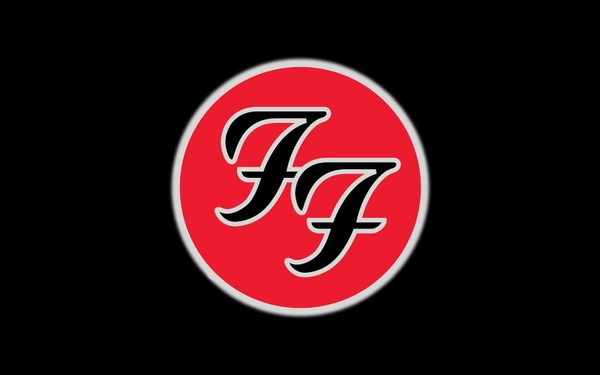

# Foo Fighters Quiz

> Essa é para você que é fã do Foo Fighters! Um quiz feito para você testar os seus conhecimentos sobre a banda.

<div align="center">
 
</div>

## :guitar: Sobre o projeto

> O projeto foi criado através da segunda Imersão React Alura onde o principal objetivo é a introdução ao framework Next.js que está em alta no mercado. O tema do projeto é criar um Quiz com tema que desejar.

## :computer: Tecnologias Utilizadas

- [Nextjs](https://nextjs.org/)
- [React](https://pt-br.reactjs.org/)
- [Styled Components](https://styled-components.com)

## :hammer_and_wrench: Instalando o projeto

> Faça o clone ou fork do repositório e depois execute o seguinte comando:

```bash
yarn install
```

## :rocket: Executando o projeto

```bash
yarn dev
```

## :computer: Projeto em produção

[Link de acesso :dizzy:](https://foo-fighters-quiz.kellyalves87.vercel.app/)
